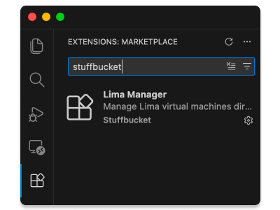

# Stuffbucket Installers

This repository contains pre-built installer packages for stuffbucket projects.

## macOS Packages

Download the latest installers from [Releases](https://github.com/stuffbucket/installers/releases).

### Available Packages

1. **stuffbucket-homebrew-1.pkg** - Sets up stuffbucket Homebrew tap
2. **stuffbucket-lima-2.pkg** - Installs Lima virtual machines

### Installation Order

Install in this sequence:
```bash
# 1. Install Homebrew tap setup
open stuffbucket-homebrew-1.pkg

# 2. Install Lima
open stuffbucket-lima-2.pkg
```

### Verification
Each release includes a SHA256SUMS file for verification:

```bash
shasum -a 256 -c SHA256SUMS
```

### Version Information
Check versions.json in each release for package versions, build timestamps, and source commit hash.

### Alternative Installation
If you prefer using Homebrew directly:

```bash
brew tap stuffbucket/tap
brew install stuffbucket/tap/lima
```

### VS Code Lima Extension
The VS Code Lima extension is now available through the Visual Studio Code marketplace:

1. Open Visual Studio Code
2. Go to the Extensions view (Cmd+Shift+X or View > Extensions)
3. Search for "stuffbucket lima" or "vscode-lima"
4. Click Install



Alternatively, you can install it from the command line:
```bash
code --install-extension stuffbucket.vscode-lima
```

### Source
All packages are built from formulas in stuffbucket/homebrew-tap.

### License
See individual package licenses in the source repository.


**Note:** This repository is automatically updated by CI from [stuffbucket/homebrew-tap](https://github.com/stuffbucket/homebrew-tap).
